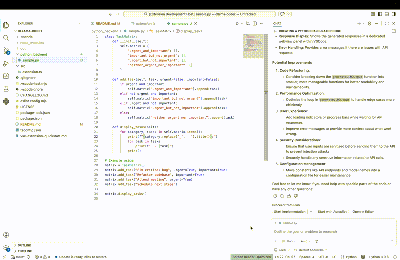

# 🚀 Agentic AI Ollama Copilot (VSCode Extension)

> Local-first AI Copilot **ollama-codex** for VSCode powered by Ollama + Agentic AI workflows


## Overview

**Agentic AI Ollama Copilot** is a VSCode extension that brings **autonomous coding assistance** directly into your editor using **local LLMs via Ollama**.

Unlike traditional copilots, this extension enables **agentic workflows** — allowing AI to:
- Understand context across files
- Execute multi-step coding tasks
- Assist with debugging, refactoring, and generation

All while running **fully local (no API dependency)**.


## Why This Exists

Modern AI coding tools like GitHub Copilot are powerful, but:
- ❌ Require cloud APIs
- ❌ Limited control over models
- ❌ Restricted customization

With **Ollama + Agentic AI**, you get:
- ✅ Local-first privacy
- ✅ Model flexibility (Llama, Mistral, DeepSeek, etc.)
- ✅ Custom workflows & prompts
- ✅ Zero API cost

Local LLM adoption is rapidly growing due to **privacy + flexibility benefits** :contentReference[oaicite:1]{index=1}

## Getting Started

1. **Install the Extension**:
   - Open Visual Studio Code.
   - Go to the Extensions view by clicking on the square icon on the Sidebar or pressing `Ctrl+Shift+X`.
   - Search for "Ollama Codex".
   - Click on 'Install' next to the extension.

2. **Configure Ollama Server**:
   - Ensure that you have an instance of Ollama running on your local machine. (If you need to install ollama visit: https://ollama.com/)
   - The default endpoint is set to `http://localhost:11434/api/chat`. If your server runs on a different port or host, update the code accordingly.

## Project Structure

```text
├── src/
│   ├── extension.ts
├── package.json
├── tsconfig.json
└── README.md
```

## Architecture

```text
VSCode Extension
      ↓
Agent Layer (Prompt + Tools + Memory)
      ↓
Ollama Runtime (Local LLM)
      ↓
Model (qwen2.5-coder:14B)
```

##  Key Components

- **VSCode Extension Layer**
  - UI integration
  - Command palette actions
  - Editor context awareness

- **Agent Engine**
  - Prompt orchestration
  - Multi-step reasoning
  - Tool execution loop

- **Ollama Integration**
  - Local inference
  - Model switching
  - Zero-latency interaction

## How to create VSIX for Azure Plugin:

- Run command: `npm install -g @vscode/vsce` to install vsce.
- Run command: `vsce package` to create vsix file. 
- Upload the new version on Azure portal [link](https://dev.azure.com)


## Usage

- **Ask Ollama**: 
  - Use the command palette (`Ctrl+Shift+P`) and type "Ask Ollama".
  - Enter your question or coding-related prompt in the input box.
  
- **Code Analysis**:
  - Select any piece of code in the editor.
  - The selected text will be automatically sent to the AI for analysis.

## Working Demo



## Contributing

We welcome contributions! If you have any suggestions, bug reports, or would like to enhance the functionality of this extension, please open an issue on our [GitHub repository](https://github.com/kparth01/agentic-ai-ollama-copilot.git).

## License

[MIT](./LICENSE) License © 2026-PRESENT [Parth Kansara](https://github.com/kparth01)

---

Feel free to reach out if you have any questions or need further assistance!
