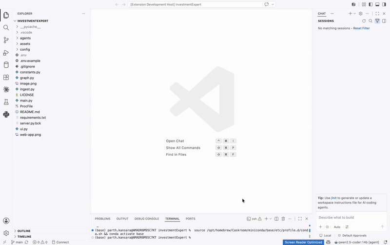
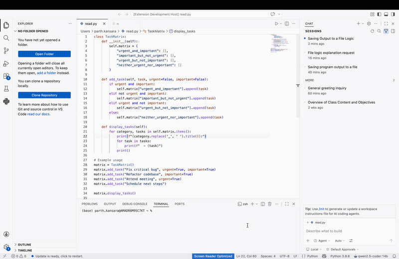

# 🚀 Ollama Copilot – Local AI Coding Assistant (VS Code Extension)

> 🚀 Local AI Copilot for VSCode  
> ⚡ Runs fully on Ollama (no API required)  
> 🧠 Agentic — it doesn't just suggest code, it writes, edits & refactors files for you.  

## Overview

**Ollama Codex** is a AI copilot extension (for VSCode) that brings **autonomous coding assistance** directly into your editor using **local LLMs via Ollama**.

Unlike traditional copilots, this extension enables allowing AI to:
- Chat directly in default VSCode Chat extension.
- Suggest code fixing. 
- Refactoring the existing code for a given file.
- Suggest fixes for configuration issues.

All while running **fully local (no API dependency)**.

## Why This Exists

Modern AI coding tools like GitHub Copilot are powerful, but:
- ❌ Require cloud APIs
- ❌ Limited control over models
- ❌ Restricted customization

With **Ollama Codex**, you get:
- ✅ Local-first privacy
- ✅ Custom workflows & prompts
- ✅ Zero API cost
- ✅ Chat-interface similar to github-copilot

Local LLM adoption is rapidly growing due to **privacy + flexibility benefits** 

## Getting Started

1. **Install the Extension**:
   - Open Visual Studio Code.
   - Go to the Extensions view by clicking on the square icon on the Sidebar or pressing `Ctrl+Shift+X`.
   - Search for "**Ollama Codex**".
   - Click on 'Install' next to the extension.

2. **Configure Ollama Server**:
   - Ensure that you have an instance of Ollama running on your local machine from [here](https://ollama.com/)
   - Install `qwen2.5-coder:14b` or `gemma4` from terminal/powershell:

        `ollama pull qwen2.5-coder:14b`
        
        `ollama pull gemma4`

## Project Structure

```text
├── src/
│   ├── extension.ts
├── package.json
├── tsconfig.json
└── README.md
```

## Architecture

```text
VSCode Extension
      ↓
Agent Layer (Prompt + Tools + Memory)
      ↓
Ollama Runtime (Local LLM)
      ↓
Model (qwen2.5-coder:14B, gemma4)
```

##  Key Components

- **VSCode Extension Layer**
  - UI integration
  - Native VSCode chat experience.

- **Ollama Integration**
  - Local inference
  - Model switching
  - Zero-latency interaction

## Working Demo

Type **`@ollama`** in the VSCode Chat box — then just describe what
you want. The assistant creates, edits and deletes files across your project on its own, fully
local. 

*Tip: prefix every request with `@ollama` to call the plugin.*

### Agentic Operations



with:

### 🤖 Agentic Flow

**Introducing Agent mode**

- Just describe what you want — **Ollama Codex** creates, edits and deletes files across your project on its own, fully local. Watch it work as above.


### Change Model Demo



## Future Release

- Onboard other models like `qwen3` and other latest.
- Add more context-window for models.

## Contributing

We welcome contributions! If you have any suggestions, bug reports, or would like to enhance the functionality of this extension, please open an issue on our [GitHub repository](https://github.com/kparth01/agentic-ai-ollama-copilot.git).

## License

[MIT](./LICENSE) License © 2026-PRESENT [Parth Kansara](https://github.com/kparth01)
